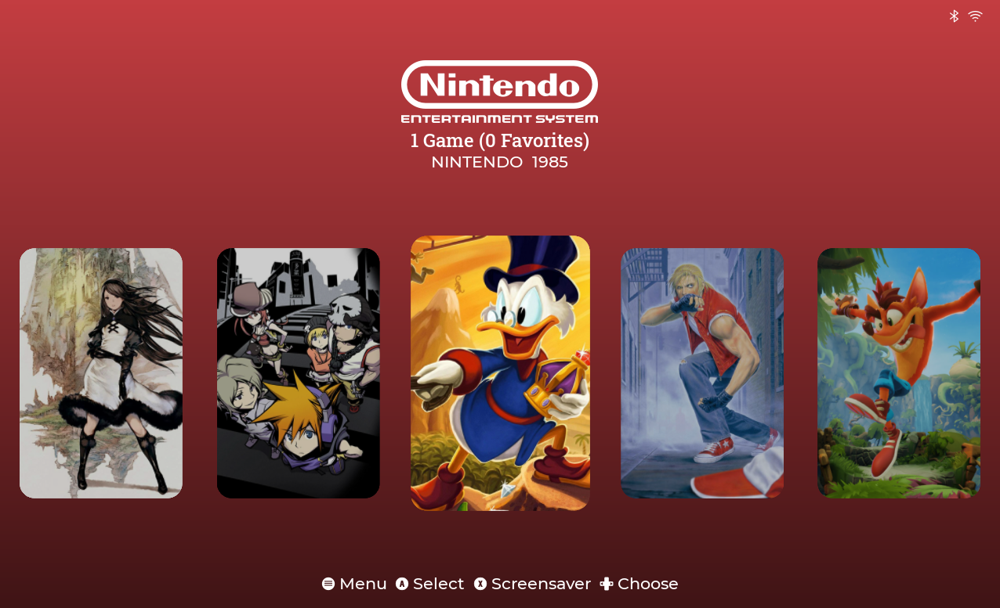

# xblue_es-de
ES-DE frontend install scripts for Raspberry Pi OS (CM5)

I Just want to make it easier for everyone to install ES-DE Frontend on top of Raspberry Pi CM5 or Raspberry Pi 5.

This frontend is very nice 😍

[See the video on youtube](https://youtu.be/agU4hXt4o2A)

[Buy me a coffee](https://buymeacoffee.com/xblue_diy)



1. [How to setup](#1-how-to-setup)
2. [Start up ES-DE frontend on top of Raspberry Pi OS](#2-start-up-es-de-frontend-on-top-of-raspberry-pi-os)
3. [Add shutdown system to the main menu](#3-add-shutdown-system-to-the-main-menu)
4. [Auto rotate the screen 90 degree when play NDS or N3DS](#4-auto-rotate-the-screen-90-degree-when-play-nds-or-n3ds)

---------------------------------------------------------------------------------------------------------------------------------

# 1. How to setup

## Install libraries
```bash
sudo apt-get install build-essential clang-format git cmake gettext libharfbuzz-dev libicu-dev libsdl2-dev libavcodec-dev libavfilter-dev libavformat-dev libavutil-dev libfreeimage-dev libfreetype6-dev libgit2-dev libcurl4-openssl-dev libpugixml-dev libasound2-dev libbluetooth-dev libgl1-mesa-dev libpoppler-cpp-dev libcec-dev libp8-platform-dev
```

## Clone the source
```bash
git clone https://gitlab.com/es-de/emulationstation-de.git
cd emulationstation-de
```

## Build the source
```bash
cmake -DGLES=on .
make -j8
```

## Install the app
```bash
sudo make install
```

After install, you will see the icon on the system menu. Games > ES-DE

---------------------------------------------------------------------------------------------------------------------------------

# 2. Start up ES-DE frontend on top of Raspberry Pi OS

## Create autostart folder in .config folder
```bash
mkdir ~/.config/autostart
cd ~/.config/autostart
```

## Create es-de.desktop in autostart folder
```bash
nano ~/.config/autostart/es-de.desktop
```

## Paste the below content
```bash
[Desktop Entry]
Type=Application
Name=ES-DE Frontend
Exec=es-de
```

Finally, Press ctrl+o to save file And ctrl+x to exit.

Done! Now you can start ES-DE frontend on top of the desktop.

It will look like you power up the handheld console 😊

Full document of ES-DE Frontend: https://gitlab.com/es-de/emulationstation-de/-/blob/master/INSTALL.md#building-on-unix

---------------------------------------------------------------------------------------------------------------------------------

# 3. Add shutdown system to the main menu

I know that this frontend already support it. But you need to enable the setting And press the button 2 times.

So I create this code to add the shutdown button on the main menu to shutdown it quickly 🙃

## Add the code below before the line addChild(&mMenu); of es-app/src/guis/GuiMenu.cpp file
```c++
// xblue: custom code
addEntry(_("SHUTDOWN SYSTEM"), mMenuColorPrimary, false, [this] { shutdownSystem(); });
```
## Add the function below before the line GuiMenu::~GuiMenu() of es-app/src/guis/GuiMenu.cpp file
```c++
// xblue: custom code
void GuiMenu::shutdownSystem()
{
    mWindow->pushGui(new GuiMsgBox(
        _("REALLY SHUTDOWN SYSTEM?"), _("YES"),
        [this] {
            if (Utils::Platform::quitES(Utils::Platform::QuitMode::POWEROFF) != 0) {
                LOG(LogWarning) << "Power off terminated with non-zero result!";
            }
        },
        _("NO"), nullptr));
}
```
## Add the code below after the line void openQuitMenu(); of GuiMenu.h file
```c++
// xblue: custom code
void shutdownSystem();
```

Then go back to the build the source, install the app step.

---------------------------------------------------------------------------------------------------------------------------------

# 4. Auto rotate the screen 90 degree when play NDS or N3DS

## Create game-start folder under ES-DE folder
```bash
mkdir ~/ES-DE/scripts/game-start
```

## Create game-start-custom.sh file:
```bash
nano ~/ES-DE/scripts/game-start/game_start_custom.sh
```

## Paste the content below:
```bash
#!/bin/bash
systems=("Nintendo DS" "Nintendo 3DS")

for system in "${systems[@]}"; do
    if [ "$4" == "$system" ]; 
    then
        ( sleep 0.5 && wlr-randr --output HDMI-A-1 --transform 90 ) &
    fi
done
```

Then Ctrl + o to save file And Ctrl + x to exit.

To rotate the screen back after exit game we need to trigger game-end event.

## Create game-end folder under ES-DE folder
```bash
mkdir ~/ES-DE/scripts/game-end
```

## Create game-end-custom.sh file:
```bash
nano ~/ES-DE/scripts/game-end/game_end_custom.sh
```

## Paste the content below:
```bash
#!/bin/bash
systems=("Nintendo DS" "Nintendo 3DS")

for system in "${systems[@]}"; do
    if [ "$4" == "$system" ]; 
    then
        wlr-randr --output HDMI-A-1 --transform normal
    fi
done
```

You also need to enable custom script at Main menu > Other settings > Enable custom event scripts

That's all, Hope you enjoy this guide ☺️
